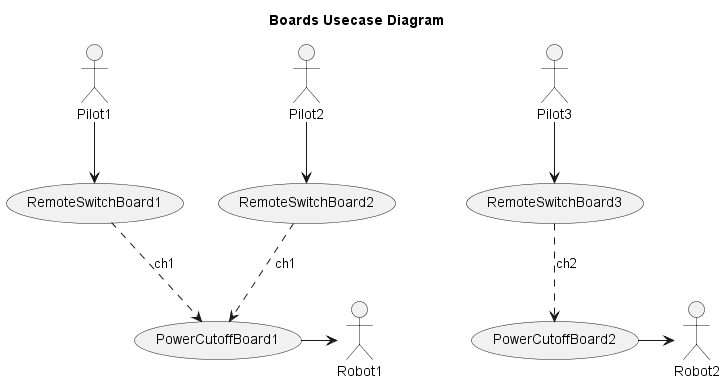

# GN10RemoteEmergencyStop
PowerCutoffBoard and RemoteSwitchBoard created by Gento Aiba.

This repository contains hardware and firmware for an emergency stop system:
- **PowerCutoffBoard**: A circuit board that cuts off power in emergency situations.
- **RemoteSwitchBoard**: A circuit board that remotely controls switches.

## PowerCutoffBoard
- [Parts List](docs/PowerCutoffBoard_parts.md)
- [KiCad Files](hardware/PowerCutoffBoard)

## RemoteSwitchBoard
- [Parts List](docs/RemoteSwitchBoard_parts.md)
- [KiCad Files](hardware/RemoteSwitchBoard)
